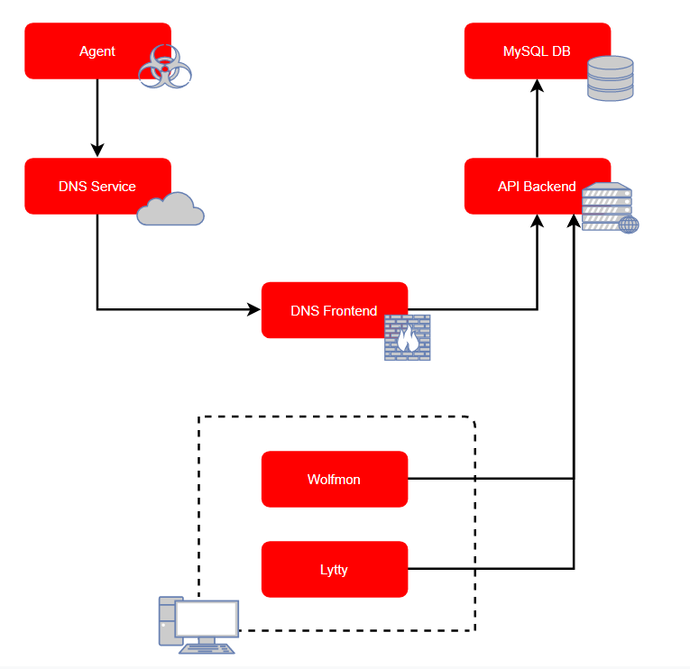

# L Y C A N T H R O P Y
[](https://forthebadge.com) [](https://forthebadge.com) [](https://forthebadge.com)

Lycanthropy is a modular post-exploitation tool instrumented with DNS and written in Java, with a distributable client to enable collaborative Red Teaming and Penetration Testing.

## Features
* DNS communication with AES-GCM-256 encryption
* Ephemeral final config and per-build password distribution
* C2 access management
* Per engagement data partitioning system
* Distributable client for collaborative testing

## Architecture
When a lycanthropy agent is executed on a target, it uses recursive lookups to route back to the DNS C2. The DNS daemon ingests and parses the requests before forwarding them onto the API backend or storing them as necessary. The API backend stores data, provides authentication and authorization, brokers configuration and package distribution, and distributes command tasks to the agents via the DNS daemon. Operators and managers send instructions to the server and receive direct output via lytty. Wolfmon runs as a seperate terminal and manages alerting for commands that won't complete immediately.



## Installation
For quick installation, run the following. The installer will prompt you to create an administrative user, who can add operators to the server.

```
git clone https://github.com/kryptops/lycanthropy
cd lycanthropy
./installer.sh
cd svc
python3 lysys.py
```
On an install that can access the api server (or from a terminal on the api server), run...

```
python3 wolfmon.py
```

Then, in another terminal, run...

```
python3 lytty.py
```

## Acknowledgements
Special thanks to <a href="https://twitter.com/romz0mbie">@romz0mbie</a>, who prototyped the logo for lycanthropy
